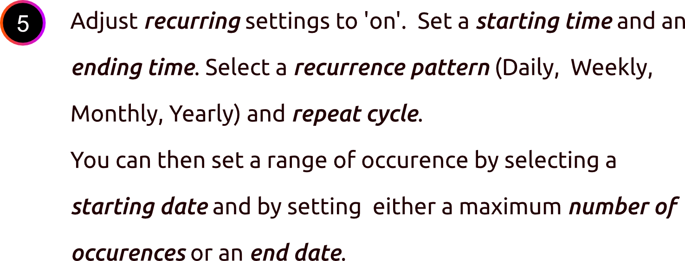
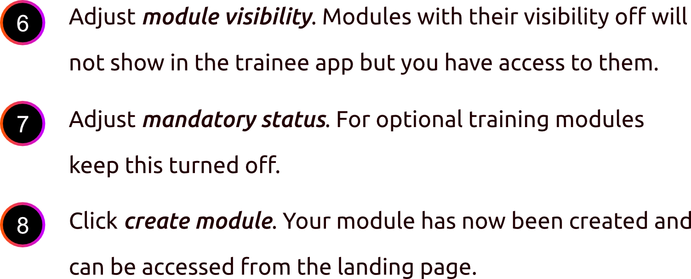

# Course Creation

## Training Module Creator

### To create a new module:

<figure><figcaption></figcaption></figure>


If your training method or training type isn't on the suggestions, you can add your own then select it from the drop-down list.


#### Scheduler

The scheduler set-up is entirely dependent on whether your module is a once-off event or a recurring one.

<figure><figcaption>
Recurring Training Module Set-up
</figcaption></figure>

<figure><figcaption>
Non-recurring Training Module Set-up
</figcaption></figure>


An enrollment code is automatically generated which can be provided to your students.


<figure><figcaption></figcaption></figure>


Subjects with their visibility off will not show in the trainee app but you have access to them.


## **What's next?**

We shall go through the workflows for course enrolment:

* Learners
* Instructors&#x20;
* Administrators

See [Course Enrolment](course-enrolment.md) for details.
