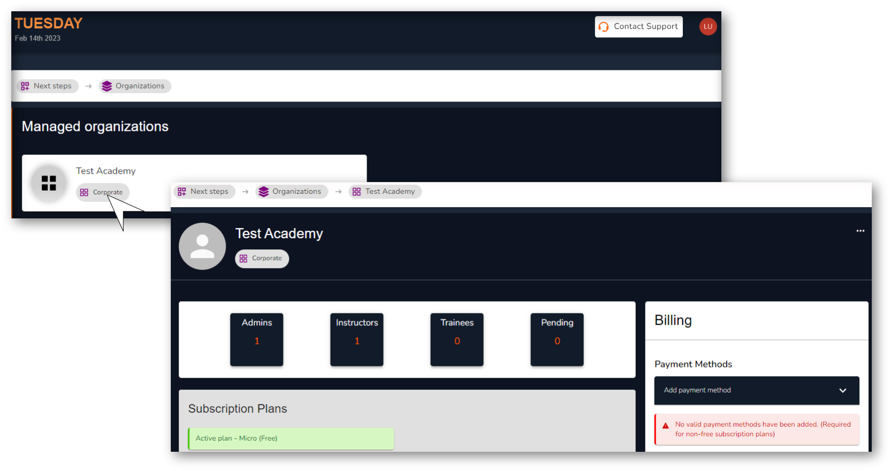

# Manage your Organization

## Section Overview

This section gives you full organization control. There is no limit to the number of organizations you can hold with Vlearned and this is where you manage all the nitty gritty details. The Vlearned system is designed to ensure ease-of-use from set up to utilization and this is where it all begins. Here, you can create organizations, add users and manage their roles. You can also  manage your organizational subscription plans according to your specific capacity and organizational needs. The next sections will show you how easy it is to do both starting with user management.

<figure><figcaption>
Organization Overview
</figcaption></figure>

## **What's next?**

We shall go through the workflows for onboarding and managing users:

* Learners
* Instructors&#x20;
* Administrators

See [Onboard and manage your users](onboard-and-manage-your-users.md) for details.
