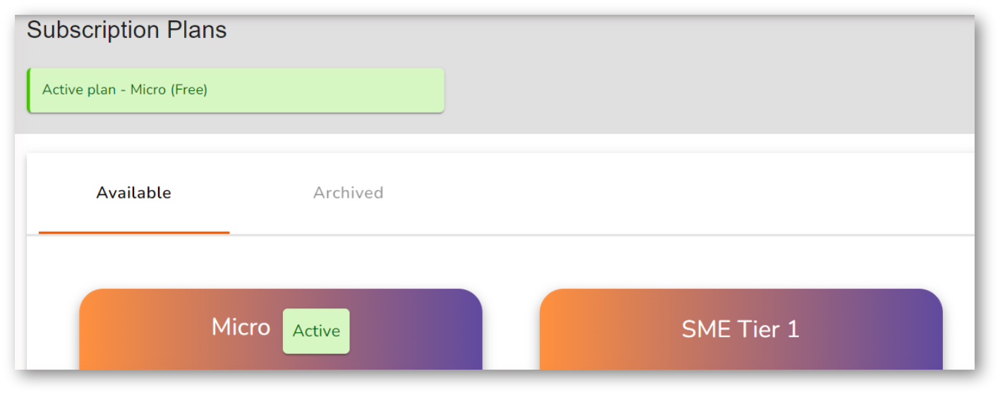
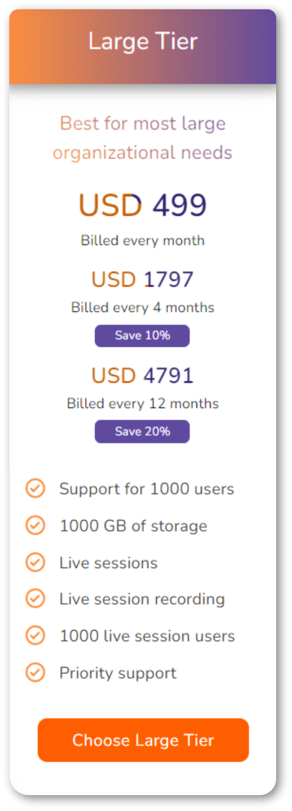
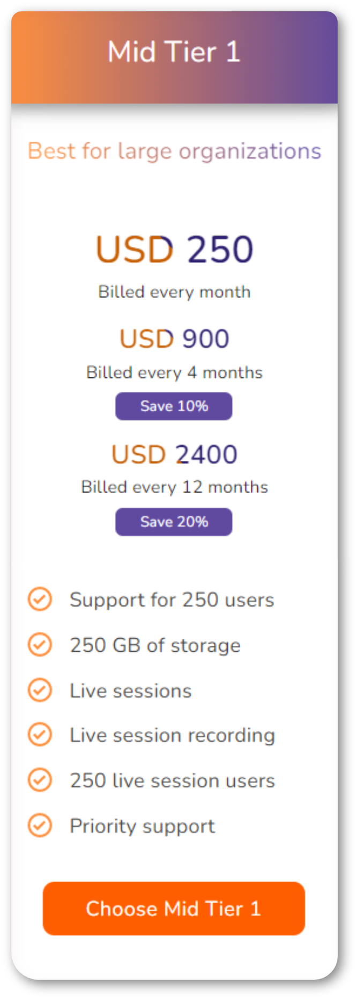
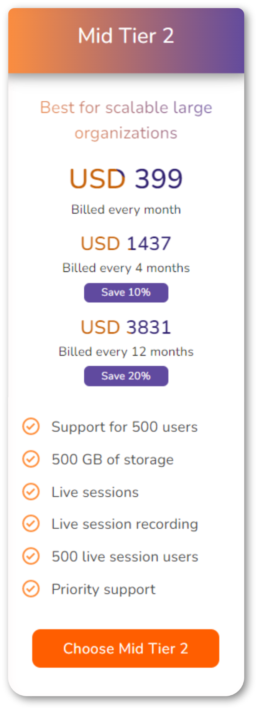
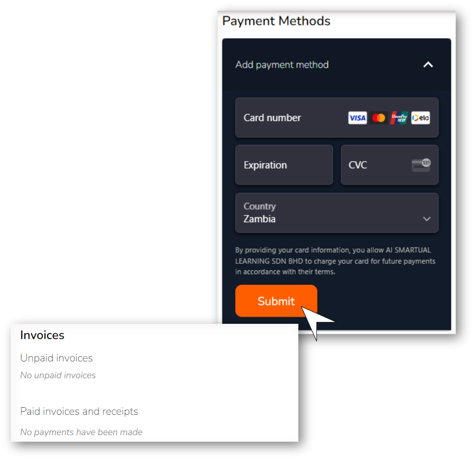
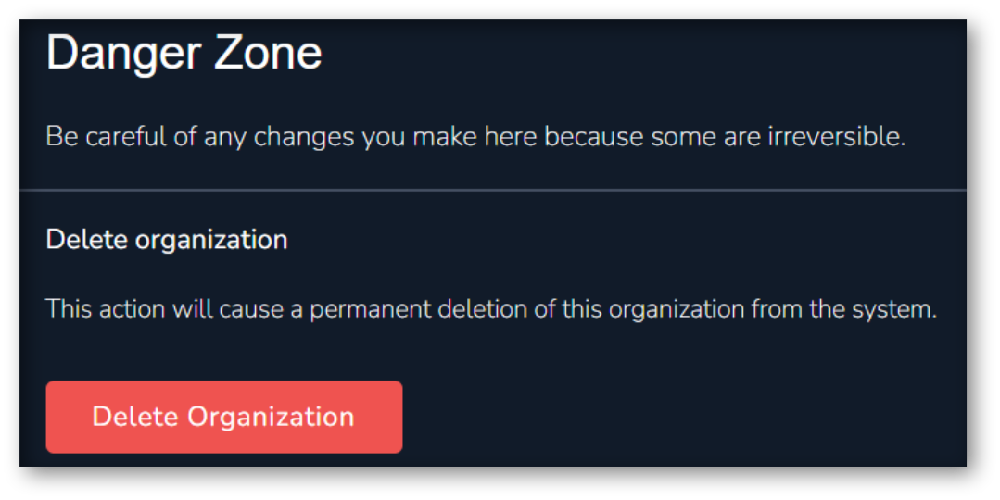

# Billing

## Billing Overview

Let's talk money, fun right? Making you happy makes us super happy so we know you will definitely enjoy this stage too. Here at Vlearned we believe in flexibility and ensuring you get exactly what you paid for and then some. So our billing process is entirely based on you and what you want our system to be able to do for you.&#x20;

<figure><figcaption>
Vlearned Subcription Plans
</figcaption></figure>

### Subscription Plans

The first part of this section will notify you of what subscription plan your organization is on. We have six tiers available depending on your institution size and training needs; _Free plan (Micro), SME Tier 1, SME Tier 2, Mid Tier 1, Mid Tier 2 and Large Tier._ Each organization is initially automatically subscribed to the free plan. As an administrator you can choose and change the subscription plan for your organization. Each tier differs in user capacity, server storage space allocated and live sessions capacity. The subscription method varies according to your organization's choice of payment schedule; manual or automated.

<figure><figcaption>
Micro/Free Plan
</figcaption></figure>

 

<figure><figcaption>
SME Tier 1
</figcaption></figure>

 

<figure><figcaption>
SME Tier 2
</figcaption></figure>

<figure><figcaption></figcaption></figure>

 

<figure><figcaption></figcaption></figure>

 

<figure><figcaption></figcaption></figure>

### Manual Payments

If your organization chooses a manual payment schedule, you can communicate with the Vlearned support team on your choice of subscription plan. The support team will assign the plan to your organization and you will receive an invoice in the billable period which has to be paid within 30 days. Once the payment has been made you will receive a receipt via email which can also be seen under paid invoices and receipts.

### Automated Payments

For auto payments you need to provide a card in the payment methods section before choosing a plan. Simply enter your card details; card number, CVC and country of issue then click submit. The system will charge this card the due amount in each chargeable period and issue both an invoice and a receipt via email to your organizations email address. The receipts and invoices (paid and unpaid) can be seen under invoices.

<figure><figcaption>
Automated Payments
</figcaption></figure>

### Changing Plans

The great part about Vlearned is if you wish to switch your subscription plan the unused allocated components of your subscription fee are computed and factored into the plan cost that you are switching to. You can contact any of our super administrators to find out more on how this works.

### Danger Zone

This section enables you to delete your organization from the system. You should be very careful however as some actions taken here cannot be undone.

<figure><figcaption>
Danger Zone
</figcaption></figure>

## **What's next?**

We shall go through the workflows for onboarding and managing courses:

* Learners
* Instructors&#x20;
* Administrators

See [Create and Manage your Courses](../create-and-manage-your-courses/) for details.
