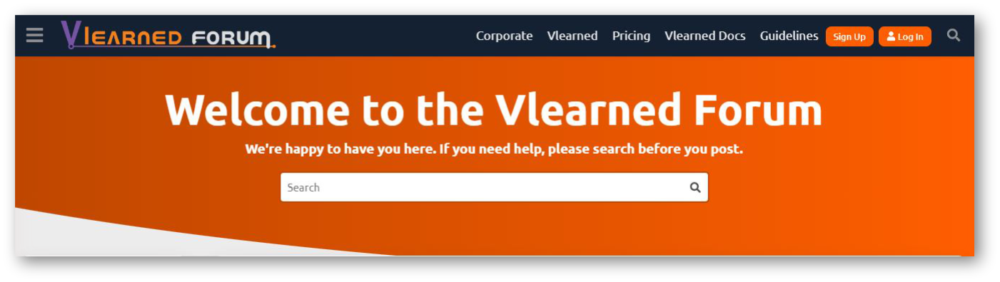

# Vlearned Help and Support

If you have clicked on this section, then I am sure you have seen our epic Vlearned forum. Here you’ll find discussions around features, how to use Vlearned, our product roadmap, and general conversation. In terms of help and support, the forum is designed to enable you to communicate with us on those issues you just cannot seem to figure out. Don't get us wrong, our system is great but it is not infallible so whether it is a problem on our end, a suggestion or you just need some assistance from us in navigating the system we are here for you. We make this easy for you using our super awesome support ticketing system also accessible on our Vlearned forum. We will explain how the ticketing system works first just to make your forum experience that much better.

<figure><figcaption></figcaption></figure>

## **What's next?**

We shall go through the workflows for support ticketing:

* Search Bar
* Categories
* Raising a Query

See [Support Ticketing](support-ticketing.md) for details.

