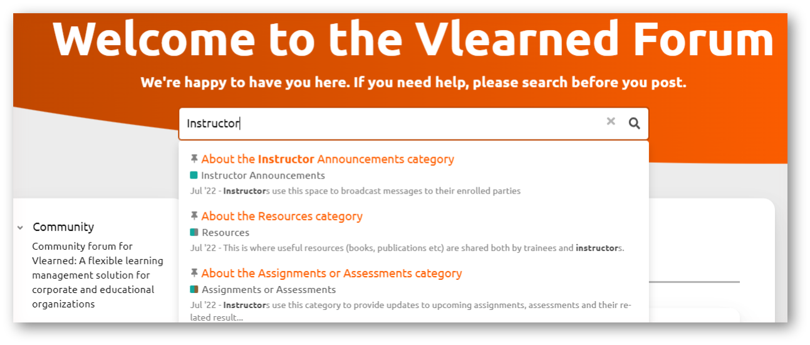

# Support Ticketing

### Search Bar

You are having a challenge with the system (oh no!). Do not worry; we hear you, we see you, we believe you, this is a safe space. While we do believe you we also believe in probability and likelihood here (I mean just look at our [Reporting and Metrics Analysis](../reporting-and-metrics-analysis.md) tool). This means if you are having a challenge, chances are someone else may have brought this up before you. We at Vlearned are so thoughtful that we have populated all the most likely information you might need at any given time on the Vlearned Forum. So the first thing we advise on when seeking assistance is to do a search. This involves typing in a few key words of your problem ideally the role it is associated with and you will be provided with possible challenges and solutions. So quick and easy, it is unbelievable.&#x20;

<figure><figcaption>
Vlearned Forum Search Bar
</figcaption></figure>

### Categories

Don't know what to search for? Your problem is brand new and the search bar has failed you? Worry not we have you covered, the forum provides a number of categories each designed to target a specific client need. Once you click on one of these you will find previously raised queries in that category as well as our staff solutions and you can raise your own as well.

<figure><figcaption>
Vlearned Forum Support Categories
</figcaption></figure>

### Raising your query

You can raise a query on the forum as long as you are logged in with your Vlearned account. Ensure to pick a category you think your query most relates to and raise your topic there. Our staff will provide feedback to your query in as timely a manner as possible.&#x20;

<figure><figcaption>
Vlearned Forum New Topic
</figcaption></figure>

## **What's next?**

We shall go through the workflows for the Vlearned forum:

* About the Vlearned forum
* Access to the Vlearned forum

See [Vlearned Forum](vlearned-forum.md) for details.
