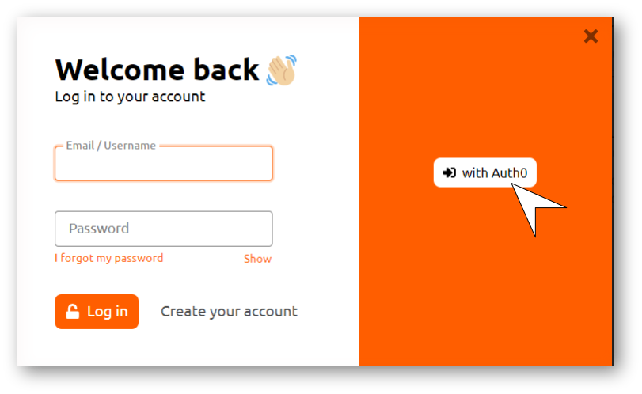

# Vlearned Forum

### About the Vlearned Forum

This is our personal favorite thing to talk about and you are going to love us for this. I know we say that about everything but this time you get to agree with us and maybe (though very unlikely) disagree. This section leads you to this magical spot we call the Vlearned forum which is really just this wonderful community of Vlearned users just like you. You can find literally all things Vlearned related on our forum and we get to interact with each other on the good, the bad and the latest information that you really don't want to miss out on. I know you are already dying to check it out so why not head over there now via the link below:



### Access to the Vlearned Forum

At this point, I am sure you are just dying to rave to about the awesomeness that is Vlearned. Well you don't have to go through another long tedious process to create a forum account. Our authentication system allows you to use your Vlearned account to log in with ease. Even better, after initial log-in the authentication system identifies your IP address and logs you in at a simple click of the Auth0 button. No input needed! Isn't that great? Log-in and let us know.

<figure><figcaption>
Vlearned Forum Log-in
</figcaption></figure>
