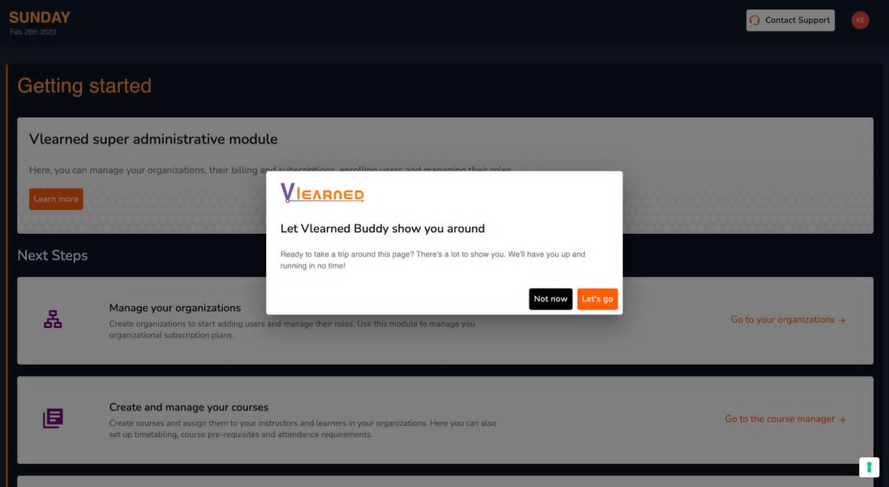
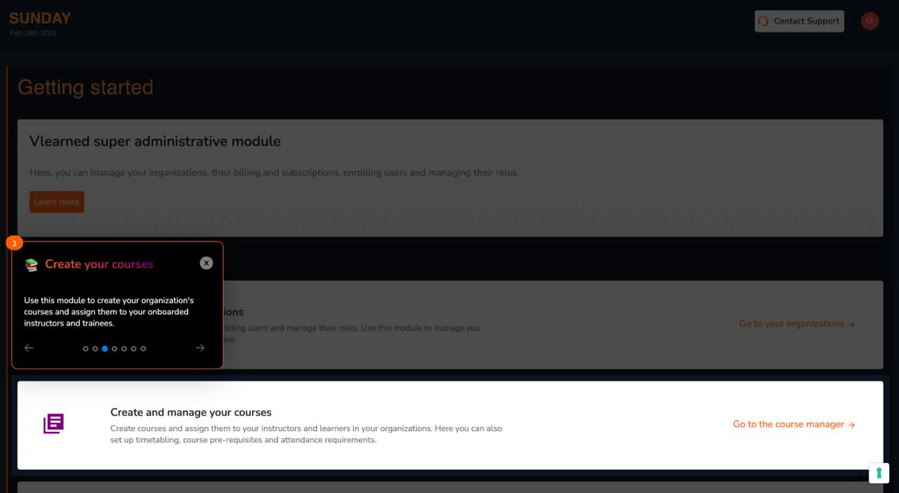
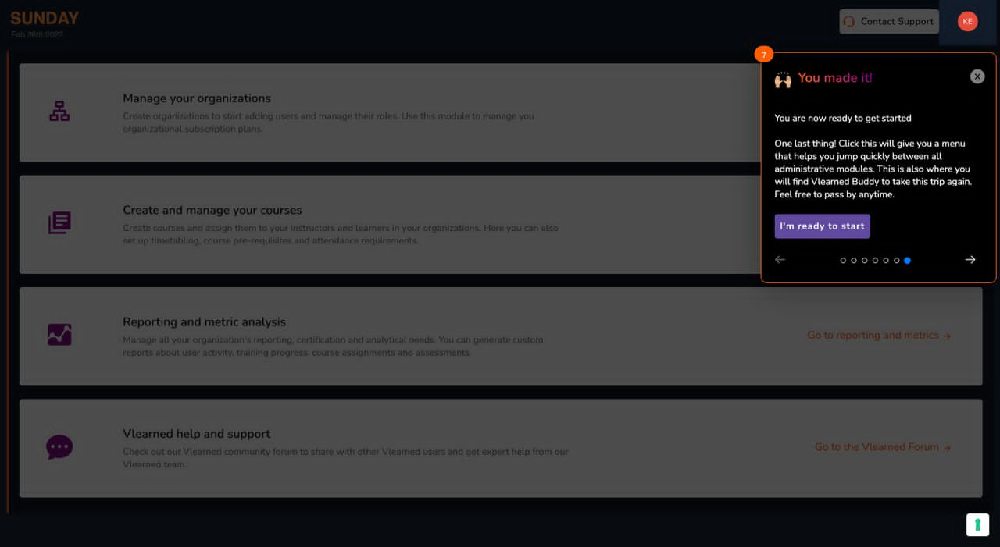

# Vlearned Buddy

### Who is your Vlearned Buddy?

<figure><figcaption>
Vlearned Buddy Welcome
</figcaption></figure>

Vlearned Buddy is your very own tour guide designed to ease your navigation around your user module. Your buddy will give you an optional tour of all the functional aspects of your role whether you are an administrator, instructor or trainee.

### What can your Vlearned Buddy do?

Below is an illustration of the Vlearned Buddy associated with an administrator role giving the user guidance on course creation. Each Buddy has been designed to ensure you can confidently utilise the system to the full extent of your user role.

<figure><figcaption>
Vlearned Buddy Illustration
</figcaption></figure>

### Where can you find your Vlearned Buddy?

<figure><figcaption>
Vlearned Buddy Location
</figcaption></figure>

Your Vlearned Buddy will appear when you first log into the system and give you an optional tour. However, should you encounter some challenges or maybe you simply forget what is what and where; you can still get a refresher tour by clicking on your initials on the top right corner of your landing page.&#x20;
