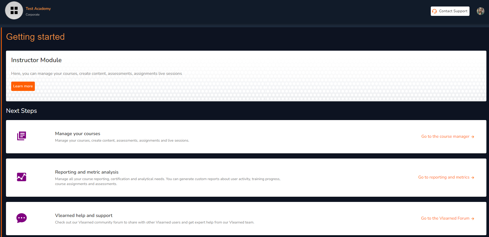

# Vlearned Instructor Module

<figure><figcaption>
Vlearned Instructor Module
</figcaption></figure>

### Instructor Module Overview

As an instructor, you can manage your course content and delivery from here. Spreading knowledge is an admirable feat and our goal is to ensure you have the essential building blocks for efficient delivery to your trainees. There are three components under this module.


[manage-your-courses](manage-your-courses/)



[reporting-and-metric-analysis.md](reporting-and-metric-analysis.md)



[vlearned-help-and-support.md](../vlearned-help-and-support.md)

