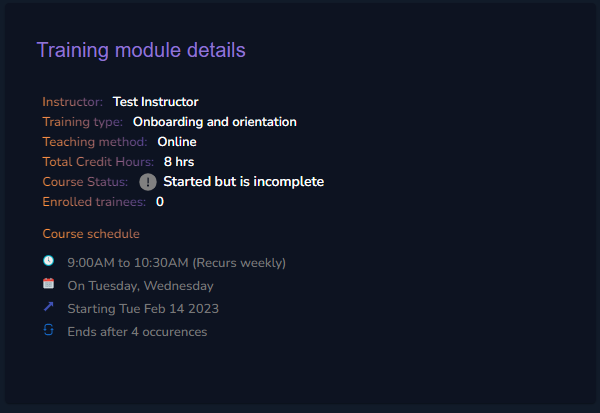
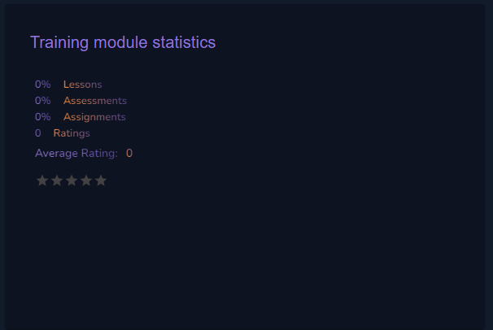
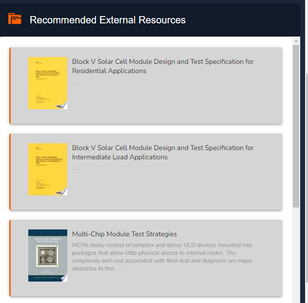

# Course Overview

### Course Description

In this section you can view and edit the description your organization provided when creating the course. This can be edited at any time by clicking on the menu in the top right corner.

<figure><figcaption>
Course Description
</figcaption></figure>

### Course Details

This section provides a summary of the course details that is; **Instructor**, **Training type**, **Teaching** **method**, **Total credit hours**, **Course Status**, number of **Enrolled trainees** and the **Course schedule**.

<figure><figcaption>
Course Details
</figcaption></figure>

### Course Statistics

In this section you can access a summary of your course statistics such as percentage of completed **Lessons**, **Assignments** and **Assessments**. You can also see the **Average** **Rating** of your subject by your trainees.

<figure><figcaption>
Course Statistics
</figcaption></figure>

### Recommended External Sources

To ensure your trainees get the most out of their learning experience, our team embedded a predictive tool which analyses the text provided in your course description and lessons to recommend relevant sources of information.

<figure><figcaption>
Recommended External Sources
</figcaption></figure>


Don't worry about sending these books to your trainees, they can view them from their end. Your role is to be as precise as possible in you course and lesson descriptions.


### Course Content

Finally, the good stuff!&#x20;

<figure><figcaption>
Course Content
</figcaption></figure>

This is where you get to create and view your lessons, assignments and assessments. In the next few sections we will discuss how to go about the content creation process.
