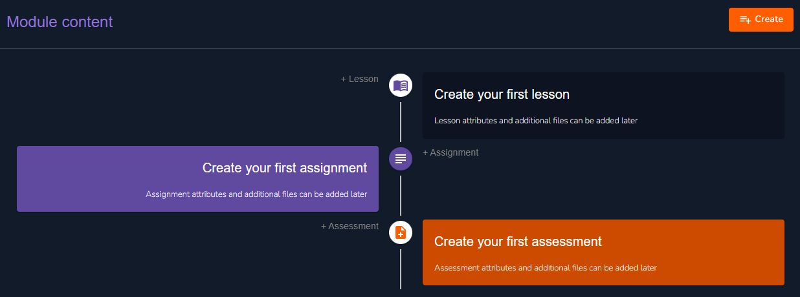

# Content Creation

<figure><figcaption>
Course Content Development
</figcaption></figure>

This is what your course content section looks like as you begin, it is up to you to fill in the details. Here you get to create your lessons, assignments and assessments. Of particular note is the **Create** button in the top right hand corner of the page. Alternatively, as you are starting out you can simply click on the particular aspect you'd like to design for; lesson, assignment or assessment. Let's begin to build these.


The system will follow the schedule assigned to the content and that is how it will appear on the dashboard.

