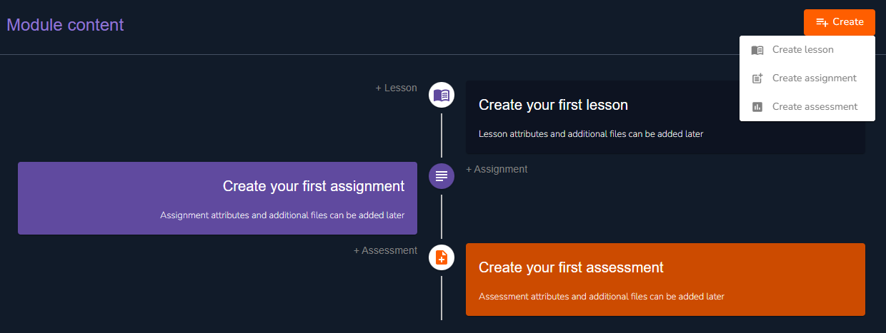
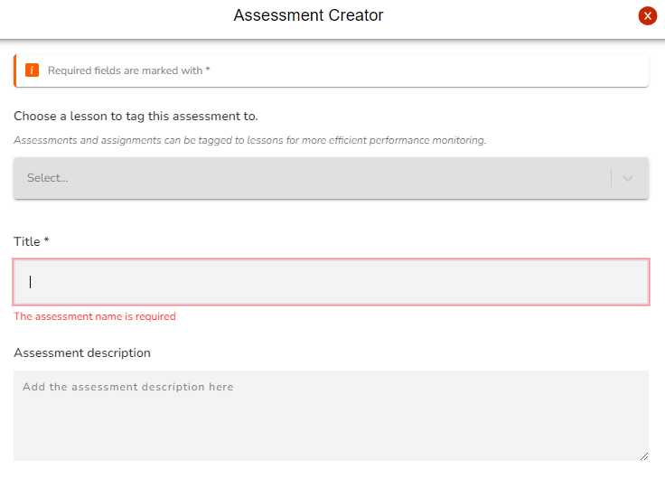
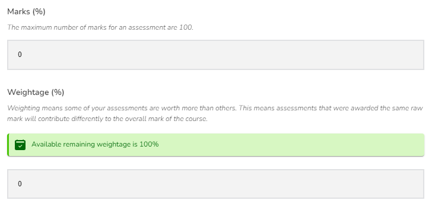
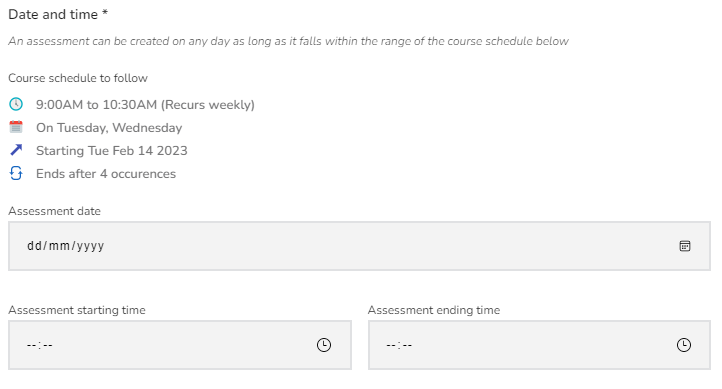
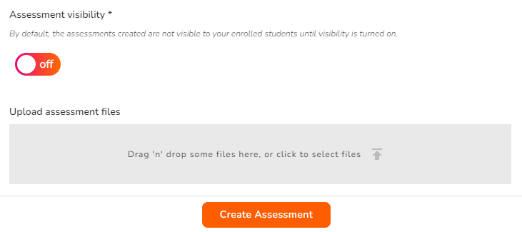

# Assessment Creation

<figure><figcaption>
Create Assessment
</figcaption></figure>

Click on **Create assessment** from the drop-down list of the create button. Alternatively you can select **Create your assessment** to get started. Several form fields are provided to ease your assessment build-up.

### Basic Assessment Information Fields


You can link your assessment to particular lessons that are covered in the questions. This helps facilitate your trainees revision process.


<figure><figcaption>
Basic Assessment Information Fields
</figcaption></figure>

### Marks and Weightage


The weightage is the percentage this particular assessment contributes to the overall grade. The students attained marks in the assessment will be converted to this weight when computing their overall grade for the course.


<figure><figcaption>
Marks and Weightage
</figcaption></figure>

### Date and Time

You can set the duration for your assessment here.

<figure><figcaption>
Date and Time
</figcaption></figure>

### Assessment Visibility and Assessment Files

<figure><figcaption>
Assessment Visibility and Assessment Files
</figcaption></figure>


You can create your assessments prior and only turn on visibility on the date it is being conducted.



Add any files required for the assessment here.


### Let's have a look!

Right now we have populated our dashboard with a lesson, an assignment and an assessment. If all these have their visibility on, your trainees will be able to access these from their dashboards. This is what your dashboard should be looking like right now:

<figure><figcaption>
First Content Dashboard
</figcaption></figure>

Next we will explore the assessment we created.
