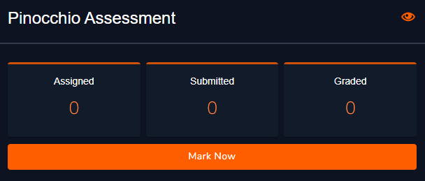
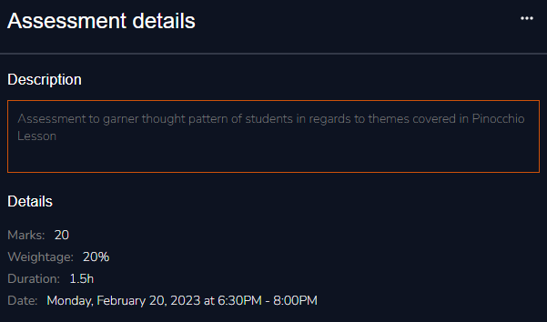
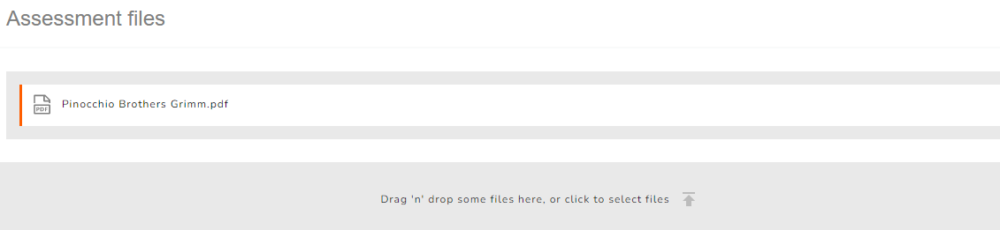
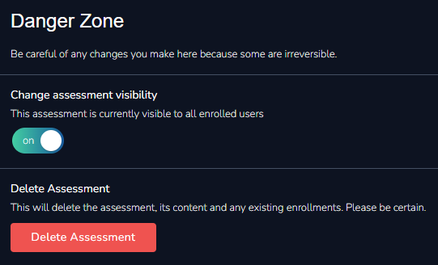
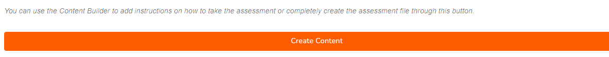

# Assessment Overview

### Submission Summary

This section allows you to view the submission details; total number of students assigned to, total number of trainees who submitted and how many you have graded. This section is also where you grade the submissions from. To grade an assessment simply click **Mark Now**.

<figure><figcaption>
Assessment Submission Summary
</figcaption></figure>

Follow the link below for a full breakdown of the grading process:


[grading.md](../../../grading.md)


### Assessment Details

You can view and edit the assessment details you entered prior in this section. To do so simply click on the menu in the top right corner.

<figure><figcaption>
Assessment Details
</figcaption></figure>

### Assessment Files

<figure><figcaption>
Assessment Files
</figcaption></figure>

This section displays any files you may have uploaded in relation to your assessment and allows you to add new ones or delete the existing ones.

### Danger Zone

This section enables you to delete your lesson from the system and turn off its visibility.


Be careful of any actions taken here as they might be not only be detrimental but irreversible.


<figure><figcaption>
Assessment Danger Zone
</figcaption></figure>

### Content Builder

The content builder is a great tool which allows you to design your assessment with a number of components like multiple choice questions, True/False sections and so much more.

<figure><figcaption>
Assessment Content Builder
</figcaption></figure>

We will discuss the variety of building blocks available for you to utilise in the next section.
