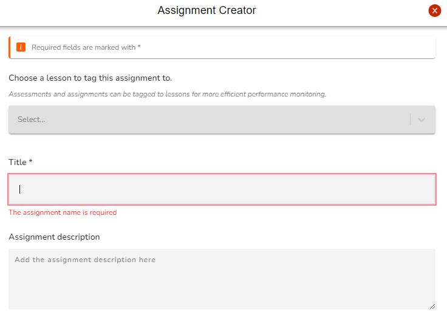
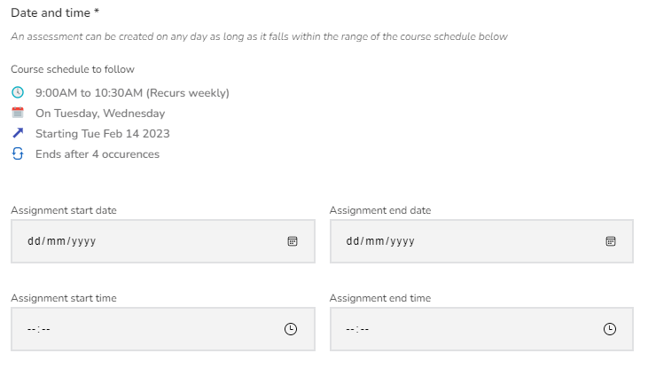
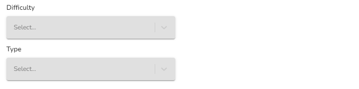
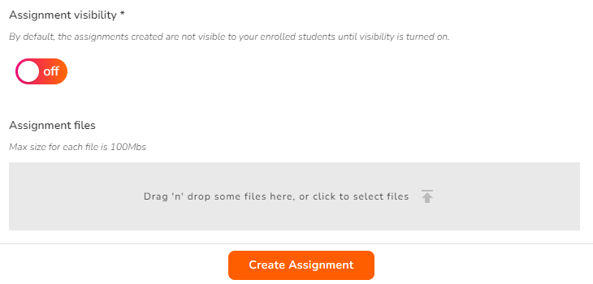
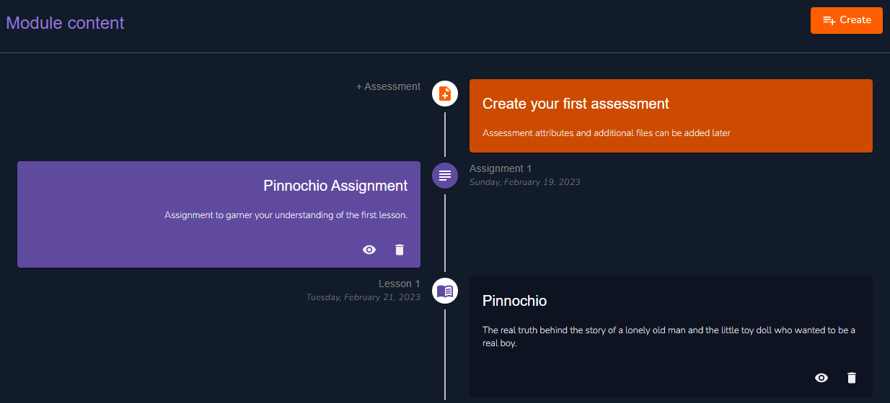

# Assignment Creation

<figure><figcaption>
Create Assignment
</figcaption></figure>

Click on the **Create assignment** from the drop-down list of the create button. Alternatively you can select **Create your first assignment** to get started. Several form fields are provided to simplify the process.

### Basic Assignment Information Fields


You can link your assignment to particular lessons that are covered in its scope.


<figure><figcaption>
Basic Assignment Information Fields
</figcaption></figure>

### Marks and Weightage


The weightage is the percentage this particular assignment contributes to the overall grade. The students attained marks in the assignment will be converted to this weight when computing their overall grade for the course.&#x20;


<figure><figcaption>
Marks and Weightage
</figcaption></figure>

### Date and Time

You can set a due date and time for your assignment here.

<figure><figcaption>
Date and Time
</figcaption></figure>

### Difficulty and Assignment Type

Assignment difficulty can be set to **easy**, **medium** and **hard**. Additionally indicate if the assignment is an **individual** or **group** assignment.

<figure><figcaption>
Difficulty and Assignment Type
</figcaption></figure>

### Assignment Visibility and Assignment Files

<figure><figcaption>
Assignment Visibility and Assignment Files
</figcaption></figure>


You can create assignments prior and only turn on visibility when you are ready to assign it to your trainees.



Add any files required for the assigment execution here.i


### Let's have a look!

Here's an example of what your dashboard should be looking like right now:

<figure><figcaption>
Assignment 1
</figcaption></figure>

Now that we have our first lesson and assignment, we going to explore the assignment aspects.
