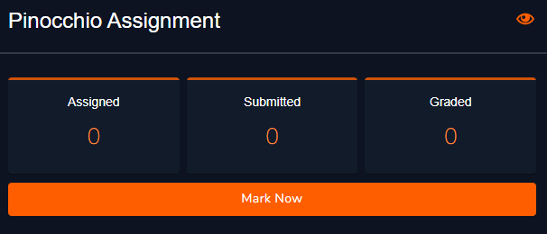
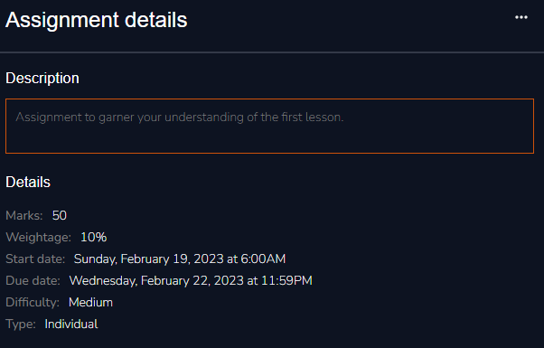
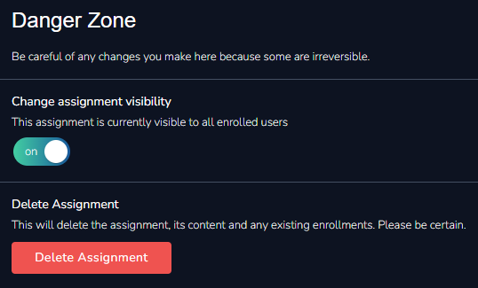
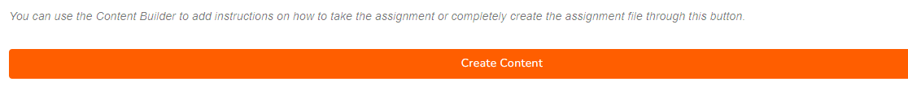

# Assignment Overview

### Submission Summary

This section allows you to view the submission details; total number of trainees assigned to, total number of submissions and how many you have graded. This section is also where you grade the submissions from. To grade an assignment simply click **Mark Now**.&#x20;

<figure><figcaption>
Submission Summary
</figcaption></figure>

Follow the link below for a full breakdown of the grading process:


[grading.md](../../../grading.md)


### Assignment Details

You can view and edit the assignment details you entered prior in this section. To do so simply click on the menu in the top right corner.

<figure><figcaption>
Assignment Details
</figcaption></figure>

### Assignment Files

<figure><figcaption>
Assignment Files
</figcaption></figure>

This section displays any files you may have uploaded in relation to your assignment and allows you to add new ones or delete the existing ones.

### Danger Zone

This section enables you to delete your assignment or adjust its visibility.


Be careful of any actions taken here as they might be not only be detrimental but irreversible.


<figure><figcaption>
Danger Zone
</figcaption></figure>

### Content Builder

The content builder is a great tool which allows you to design your assessment with a number of components like multiple choice questions, True/False sections and so much more.

<figure><figcaption>
Assignment Content Builder
</figcaption></figure>

&#x20;Follow the link below for the full breakdown of the building blocks available to you:


[content-builder.md](../content-builder.md)

