# Content Builder

The create content button leads you to the landing page shown below:

<figure>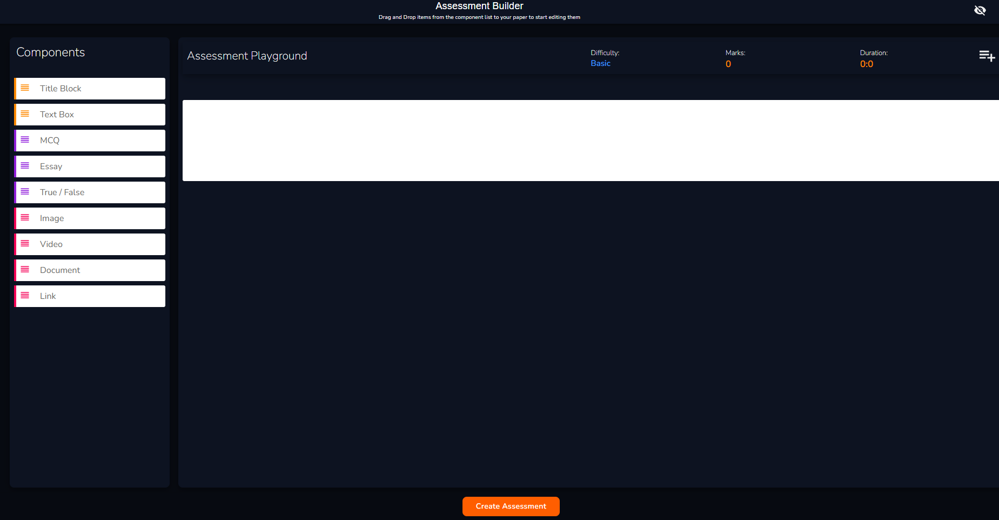<figcaption>
Vlearned Content Builder
</figcaption></figure>

To add a section to your assessment or assignment, click the **add section** button in the top right corner of the builder.&#x20;

To add a component to the section drag it from the left panel to the paper.


You can get an idea of how the assessment or assignment will look like in the trainee app by clicking on the eye in the top right corner.


The next few pages illustrate how you can build content and what it looks like in student/trainee view. They are broken down into Text Blocks, Functional Blocks and Attachment Blocks.

## Text Blocks


Text Blocks are yellow in colour.


### Title Block

The title block consists of a **title** tab and a **subtitle** tab. Insert your desired section heading information in these tabs.

<figure>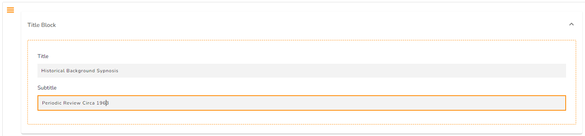<figcaption>
Title Block Input
</figcaption></figure>

## &#x20;                                                                 👁

<figure><figcaption>
Trainee View
</figcaption></figure>

### Text Box

You can use the text box to add text to your assessment/assignment.

<figure>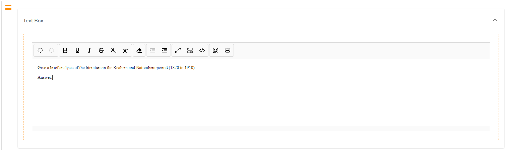<figcaption>
Text Box Input
</figcaption></figure>

## &#x20;                                                                  👁

<figure>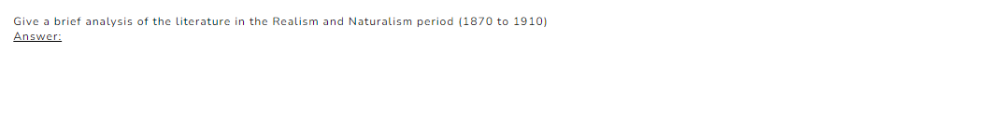<figcaption>
Text Box Trainee View
</figcaption></figure>

## Functional Blocks

These blocks are to facilitate trainee assessment and assignment components that you want to administer in the system:


Functional blocks are purple in colour.


### MCQ

You can use the MCQ component to create multiple choice questions. You can time each of these questions according to **difficulty level** and **marks**.

<figure>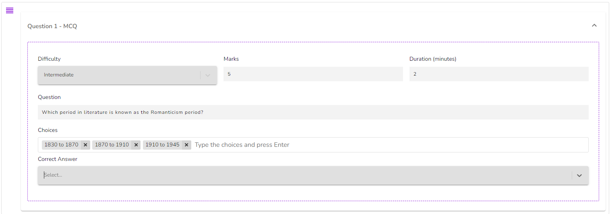<figcaption>
MCQ Input
</figcaption></figure>

## &#x20;                                                                👁

<figure>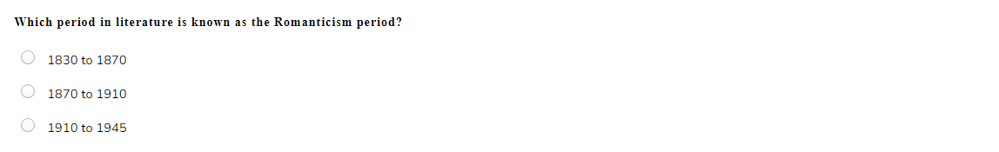<figcaption>
MCQ Trainee View
</figcaption></figure>


Ensure to enter your **Question**, **Answer Choices** and input the **Correct Answer** for the system to pick up when grading.


### Essay

You can assign essay questions using the essay component. You can time these questions according to **difficulty level** and **marks**.

<figure>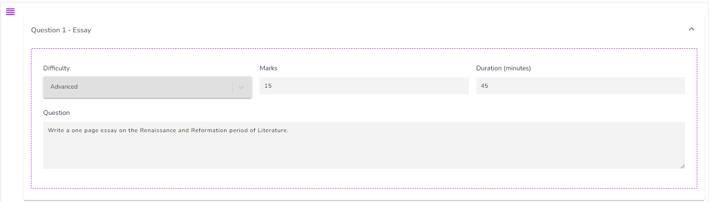<figcaption>
Essay Input
</figcaption></figure>

## &#x20;                                                                👁

<figure>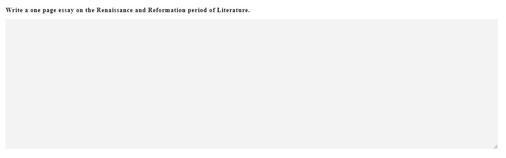<figcaption>
Essay Trainee View
</figcaption></figure>

### True/False

You can use the True/False component to create True or False questions. You can time each of these questions according to **difficulty level** and **marks**.&#x20;

<figure>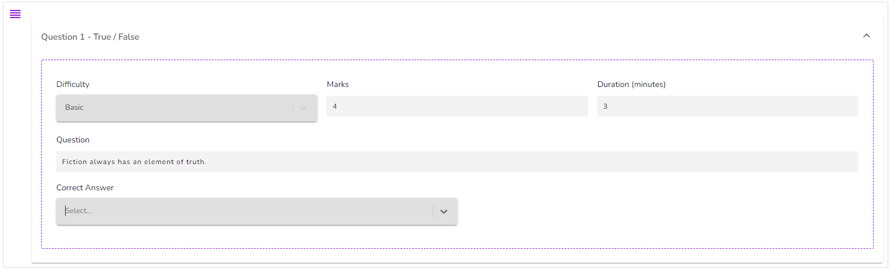<figcaption>
True/False Input
</figcaption></figure>

## &#x20;                                                                 👁

<figure>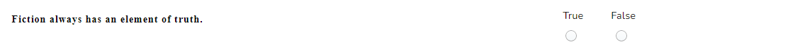<figcaption>
True/False Trainee View
</figcaption></figure>


Ensure to input your **Question** and the **Correct Answer** for the system to pick up when grading.


## Attachment Blocks

These blocks are for any files you may want to attach to your assessment or assignment. You can drag and drop the file or upload it. After you have uploaded your file you can add a caption.


Attachment blocks are red in colour.


### Image

<figure>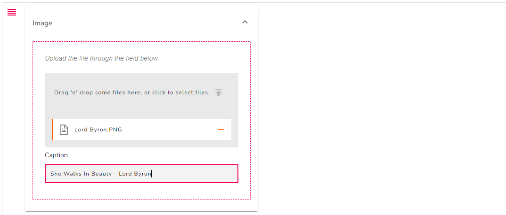<figcaption>
Image Input
</figcaption></figure>

## &#x20;                                                                👁

<figure>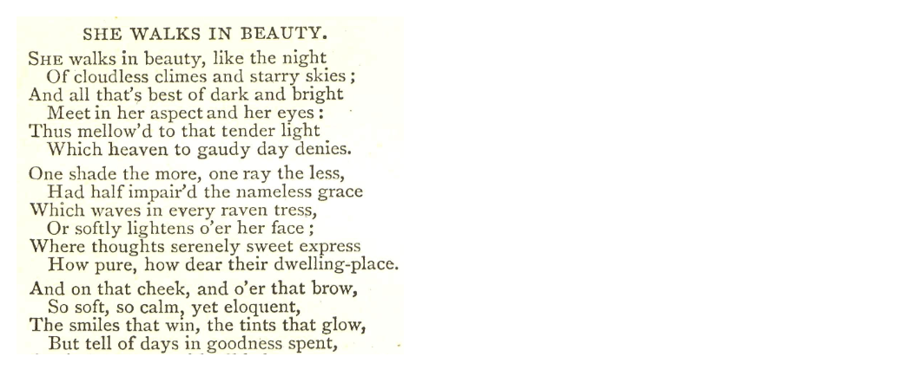<figcaption>
Image Trainee View
</figcaption></figure>

### Video

## &#x20;                                                                 👁

### Document

<figure>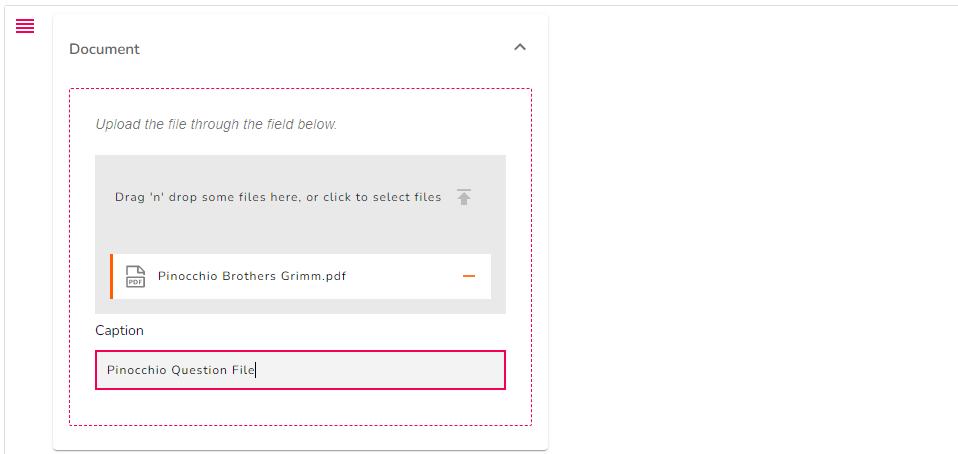<figcaption>
Document Input
</figcaption></figure>

## &#x20;                                                                👁

<figure>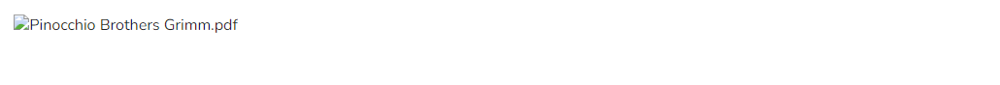<figcaption>
Document Trainee View
</figcaption></figure>

### Link

You can use the link component to add a link for your trainee's to use in the assessment/assignment.

<figure>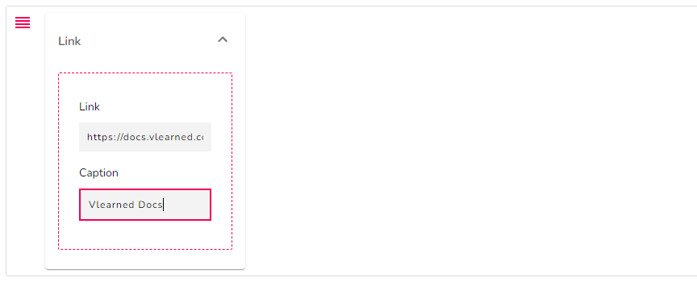<figcaption>
Link Input
</figcaption></figure>

## &#x20;                                                                👁
