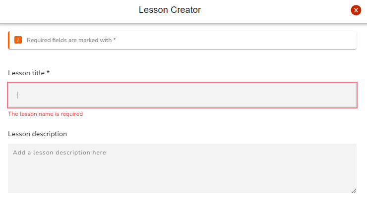
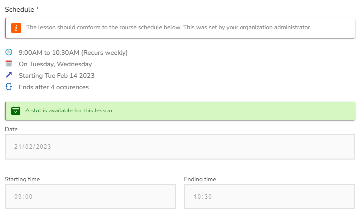
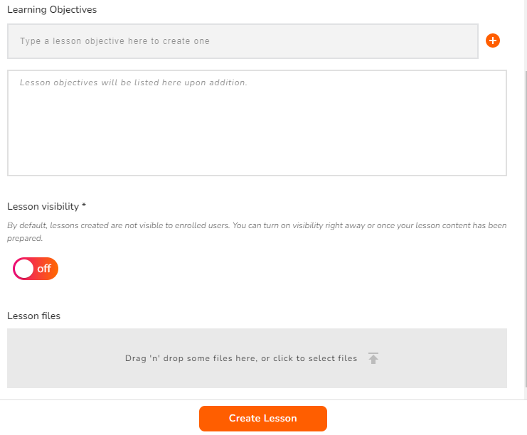
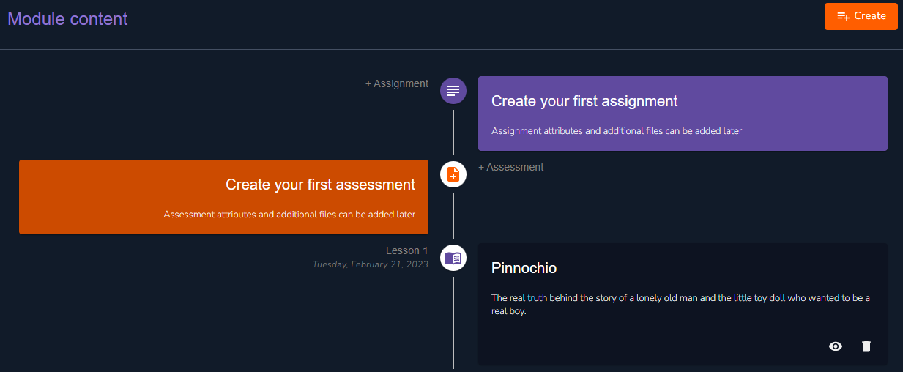

# Lesson Creation

<figure><figcaption>
Create Lesson
</figcaption></figure>

Click on **Create lesson** from the drop-down list of the **create** button. Alternatively you can select **Create your first lesson** to get started. Several form fields are provided to ease your lesson build-up.

### Basic Lesson Information Fields

<figure><figcaption>
Basic Lesson Information Fields
</figcaption></figure>

### Schedule

<figure><figcaption>
Lesson Schedule
</figcaption></figure>


A lesson schedule has already been created by your organization's administrators. Should you have any scheduling conflicts, reach out to them.


### Lesson Objectives and Lesson Visibility

<figure><figcaption>
Lesson Objectives &#x26; Lesson Visibility
</figcaption></figure>

### Let's have a look!

Here's an example of what your dashboard should be looking like right now:

<figure><figcaption>
Lesson 1
</figcaption></figure>

Now that we have our first lesson, we going to discuss how you can create your live class under it.
