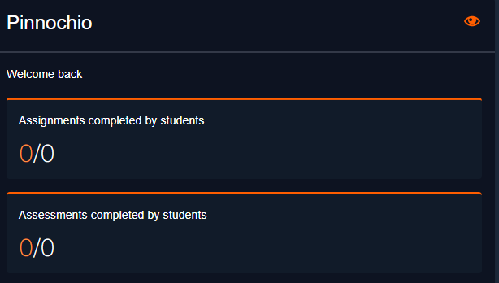
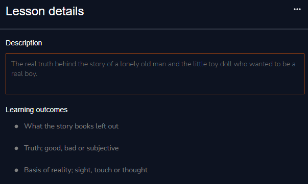
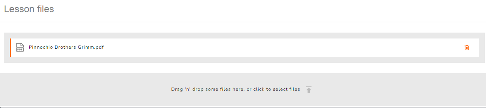
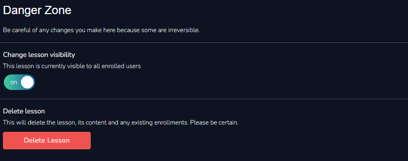
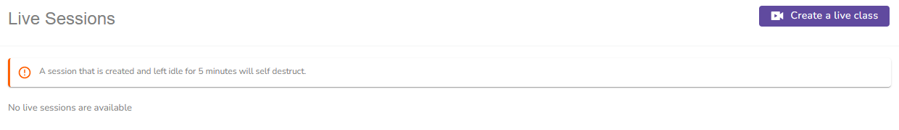

# Lesson Overview

### Linked Assignments and Assessments

<figure><figcaption>
Linked Assignments and Assessments
</figcaption></figure>

This section gives a summary on assignments and assessments that have been completed by trainees under the lesson. The specifics can be seen by clicking on either aspect.

### Lesson Details

You can view and edit the lesson details you entered prior in this section. To do so simply click on the menu in the top right corner.

<figure><figcaption>
Lesson Details
</figcaption></figure>

### Lesson Files

This section displays any files you may have uploaded in relation to your lesson and allows you to add new ones or delete the pre-existent.

<figure><figcaption>
Lesson Files
</figcaption></figure>

### Danger Zone

This section enables you to delete your lesson from the system and turn off its visibility.


Be careful of any actions taken here as they might be not only be detrimental but irreversible.


<figure><figcaption>
Danger Zone
</figcaption></figure>

### Live Sessions

This section allows you to create a live class for your lesson. To create a live class select the **Create live class button** in the top right corner of this section.

<figure><figcaption>
Live Sessions
</figcaption></figure>

A step by step illustration of how to complete this process is given in the next section.
