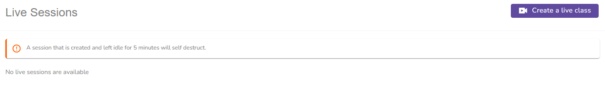

# Live Sessions

<figure><figcaption>
Live Sessions Create
</figcaption></figure>

Click on the **Create a live class button** to get started. The form fields provided are adaptive to facilitate flexibility.


Sessions once started, will self destruct if left idle for 5 minutes.


### General Settings


The Session ID is automatically generated by the system, you don't need to fill it in.


<figure><figcaption>
General Settings
</figcaption></figure>

### Recording Settings and Permissions

<figure><figcaption>
Recording Settings and Permissions
</figcaption></figure>

### Duration Settings and Scheduling

<figure><figcaption>
Duration Settings and Scheduling
</figcaption></figure>

### Participants and Webcam Settings

<figure><figcaption>
Participants and Webcam Settings
</figcaption></figure>

### Microphone Settings

<figure><figcaption>
Microphone Settings
</figcaption></figure>

### Chat Settings and Secure Access


Both moderator and attendee passwords are automatically generated so there is no need for you to remember them. The enrolled trainees will automatically receive the session password.&#x20;


<figure><figcaption>
Chat Settings and Secure Access
</figcaption></figure>
