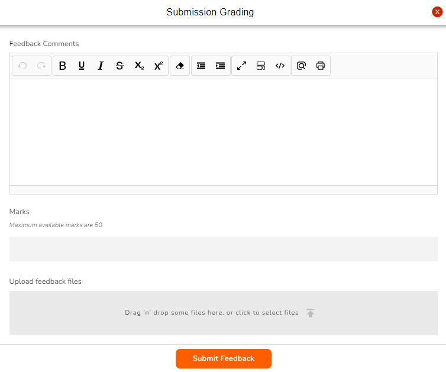

# Grading

<figure><figcaption>
Submission Summary
</figcaption></figure>

This section allows you to view the submission details; total number of trainees **Assigned** to, total number of trainees who **Submitted** and how many you have **Graded**. This section is also where you grade the submissions from. To grade an assessment simply click **Mark Now**.

### Submission Details - All Students

You can view and edit the submission details for the class in this section. To begin grading select a trainee by clicking on their name in the side panel on the left.

<figure><figcaption>
Submission Details - All Students
</figcaption></figure>

### Submission Details - Individual

After you select a trainee, this is how their submission details appear. You can grade the individual by clicking on the **Grade** button in the top right corner.

<figure><figcaption>
Submission Details - Individual
</figcaption></figure>

### Submission Grading&#x20;

The **Grade** button will open the Submission Grading field form. The fields available are for your **Feedback Comments** and the **Marks** you are awarding the trainee.

<figure><figcaption>
Submission Grading
</figcaption></figure>


Upload any files you may have relating to your feedback to the trainee e.g. student's marked transcript or separate feedback file.

