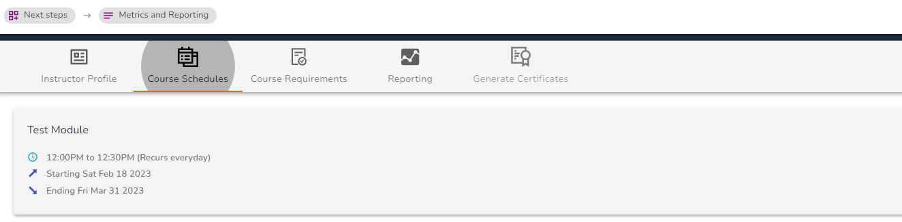
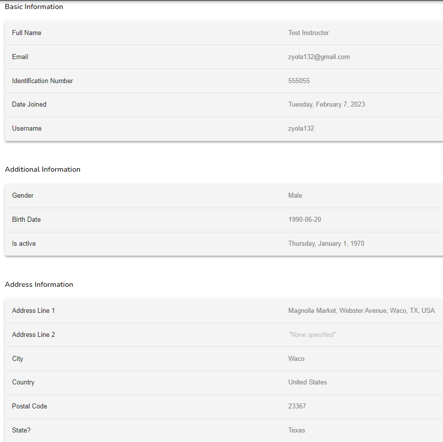
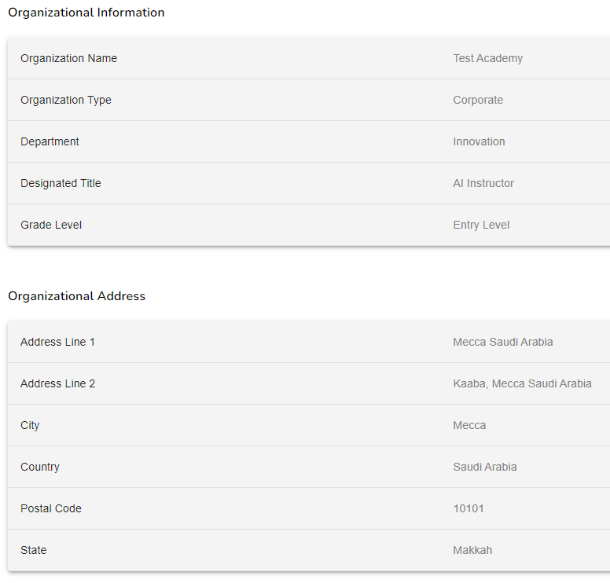
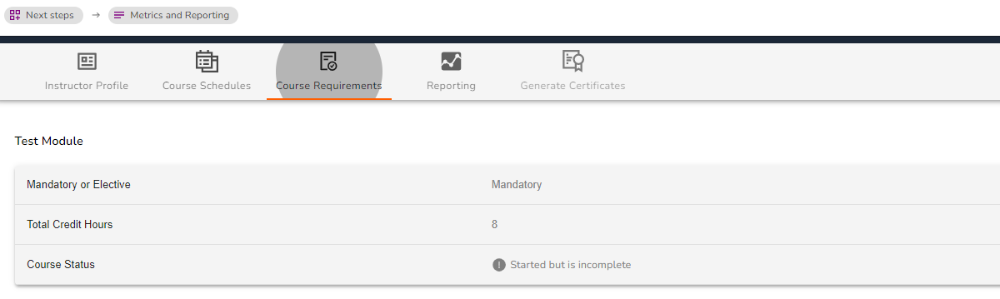
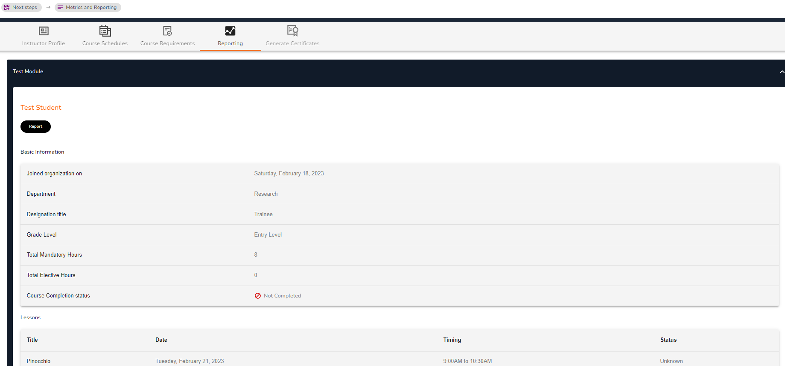

# Reporting and Metric Analysis

<figure><figcaption>
Metrics and Reporting Page (Instructor)
</figcaption></figure>

The Reporting and Metrics Analysis function is designed to help you manage all your course reporting, certification and analytical needs. Let's have a look at each section:

### Instructor Profile

Under the instructor profile you can find your personal basic information and your organizational information in regards to your role as an instructor.

<figure><figcaption>
Basic Information, Additional Information and Address Information
</figcaption></figure>

<figure><figcaption>
Instructor Organizational Information and Organizational Address
</figcaption></figure>

### Course Schedules

This section displays your course schedule inclusive of lesson timetable and course duration.

<figure><figcaption>
Course Schedules
</figcaption></figure>

### Course Requirements

This section gives you an overview of your course; **Mandatory Status**, **Total Credit Hours** and the **Course Status**.

<figure><figcaption>
Course Requirements
</figcaption></figure>

### Reporting

This section will provide you with basic information on your trainees as well as give you an overview of their learning experience in relation to your lessons, assignments and assessments. The aim is to ensure you have an overview of your trainees performance at all times and where they need additional assistance.

<figure><figcaption>
Reporting
</figcaption></figure>

### Generate Certificates

##

