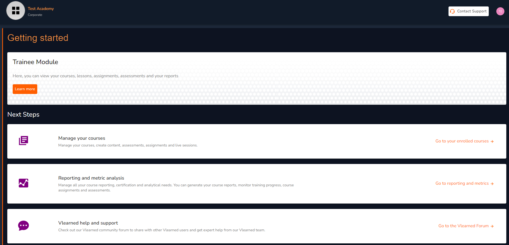

# Vlearned Trainee Module

<figure><figcaption>
Vlearned Trainee Module
</figcaption></figure>

Vlearned's architecture is designed so that you have all-round access to your lessons, assignments, assessments and reports in one place at any given time. The trainee module is responsible for the full management of your learning experience. There are three components under this module specifically adaptable to your needs:


[manage-your-courses.md](manage-your-courses.md)



[reporting-and-metric-analysis.md](reporting-and-metric-analysis.md)



[vlearned-help-and-support.md](../vlearned-help-and-support.md)


